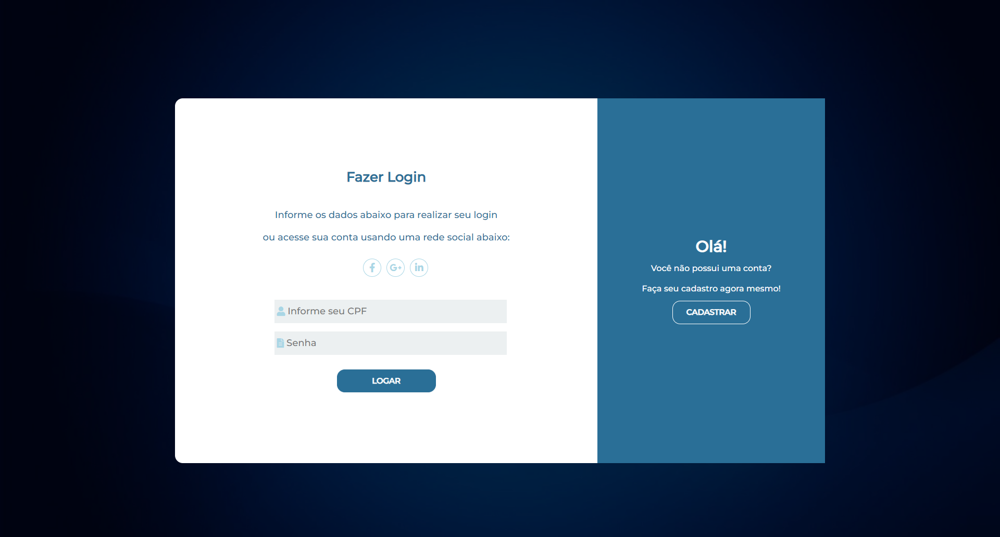
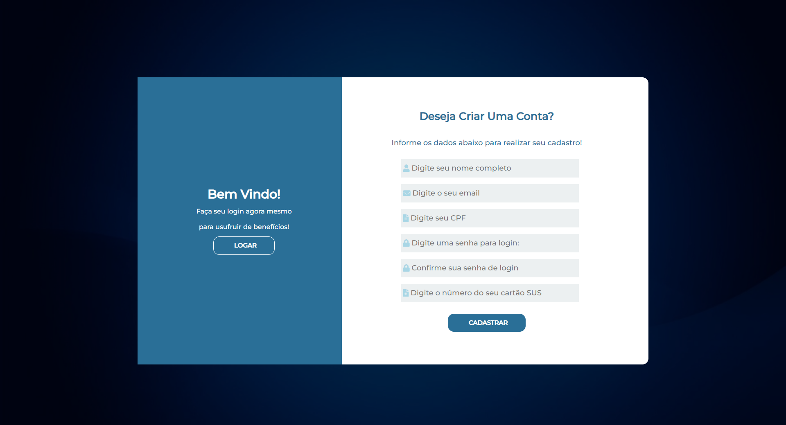

# GestaoVacina_FerramentaDigital
Versão aprimorada do Projeto-TCC-Equipe.

    Oláa! Seja bem vindo!
    Este é um repositório destinado ao projeto <strong>Carteira de Vacinação Digital.</strong> Esse projeto foi realizado por mim, Pablo Henrique e @rafaelasilverio durante o curso técnico em Desenvolvimento de Sistemas na Etec Antonio Devisate.

    Essa ferramenta digital é o resultado dos nossos anos de curso e conhecimentos adquiridos. Utilizamos de diversas ferramentas de <strong>front-end como de back-end.</strong>

## Entendendo um pouco sobre o projeto.

    A ferramenta “Gestão da Carteira de Vacinação Digital” tem como o objetivo auxiliar a população sobre as vacinas e informar precisamente o momento em que precisarão se vacinar. Em resumo a <strong>finalidade do projeto é facilitar a organização e auxiliar o mantimento do documento da carteira de vacinação em dia e em bom
    estado.</strong> Utilizando-se das vantagens de uma plataforma híbrida, quem possuir a ferramenta terá em mãos informações da sua carteira de vacinação e poderá consultálas em qualquer lugar e sempre que achar necessário!

## Objetivos do projeto.

    Os objetivos do projeto foram:
    <ul>
        <li>Gerenciar informações do controle de vacinação pessoal.</li>
        <li>Organizar eventos para facilitar o acesso da população.</li>
        <li>Compreender os dados para empregá-los de forma adequada.</li>
        <li>Alertar o usuário sobre possível vencimento de alguma vacina.</li>
        <li>Auxiliar o manuseio das informações utilizando o ambiente digital.</li>
        <li>Providenciar o acesso dos pais ao controle vacinal dos filhos.</li>
    </ul>

## Linguagens e ferramentas.

    Para fazer o front-end, utilizamos o <strong>HTML</strong> como linguagem de marcação, o <strong>CSS</strong> como nossa linguagem de estilo, <strong>JavaScript</strong> para realizar interatividade com o nosso usuário e <strong>PHP</strong> como linguagem de progamação para criar uma comunicação com o back-end e o banco de dados.

    Também utilizamos de frameworks, como o <strong>Bootstrap</strong>, para criar a nossa ferramenta responsiva e adaptável.

 

    Para fazer o back-end, as linguagens e tecnologias usadas foram o <strong>PHP, como nossa linguagem server-side</strong>, a linguagem <strong>SQL</strong> para a manipulação de banco de dados e <strong>MySQL</strong> como o nosso servidor.

## Preview

    Apresento agora para vocês, uma pré-visualização dos resultados:

### Telas de Cadastro e Login

    

    

